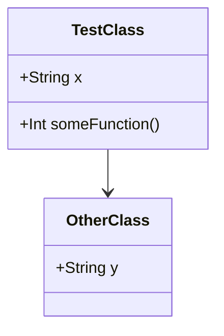

# This is a test markdown file

- this is a test

hello **there** sldkjflskdjflksjdflsj


```mermaid
classDiagram
class TestClass {
+String x
+Int someFunction()
}

class OtherClass {
+String y
}

TestClass --> OtherClass
```

```
hello
```
